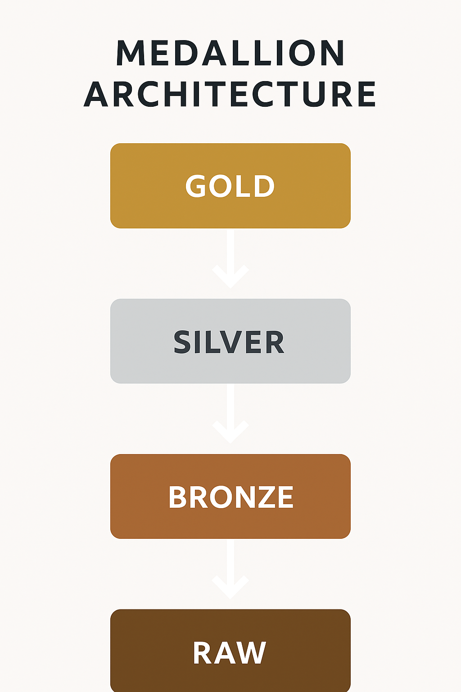

<h1 align="center">🛠️ Olist Data Engineering Project — AWS Medallion Architecture</h1>

<p align="center">
  <strong>End-to-end Data Lakehouse built with PySpark, AWS S3, and the Medallion Architecture.</strong>
</p>

---

# 📌 Overview

This project implements a full **Data Engineering pipeline** using the Olist e-commerce dataset and the **Medallion Architecture (Raw → Bronze → Silver → Gold)** on AWS S3.

It simulates a real production scenario, including:

- Data ingestion from CSV (Raw)
- Transformation and standardization (Bronze)
- Cleaning and enrichment (Silver)
- Analytical modeling with Star Schema (Gold)
- JSON schema versioning for all layers
- Protected Git workflow with Pull Requests

---

# 🏗️ Architecture

## 🔷 Medallion Architecture



### 🟫 RAW
Stores original CSV files exactly as received, without transformation.

### 🟧 BRONZE
Structured and standardized data, stored in Parquet format.

### ⚪ SILVER
Clean, enriched, analytics-ready data.

### 🟨 GOLD
Business-level tables in a **Star Schema** for BI tools and analytics.

---

# ⭐ Star Schema (Gold Layer)


The Gold layer includes:

- Fact Sales
- Dim Customer
- Dim Product
- Dim Seller
- Dim Date
- Dim Geolocation
- Fact Orders 
- Fact Seller Performance 
- Fact Product Performance

---

# 🧰 Technologies Used

| Technology | Purpose |
|-----------|---------|
| AWS S3 | Data Lake storage |
| PySpark | ETL processing and schema enforcement |
| Parquet | Optimized columnar storage |
| AWS CLI | Authentication and access |
| Python | ETL logic and orchestration |
| VSCode | Local development |
| GitHub | Versioning and PR workflow |

---

# ⚙️ Running the Project Locally

##  Initialize Spark with S3 Access

# This project uses protected main branch + Pull Request workflow.

Branch strategy:

main                  → stable production branch
feature/raw-layer     → Raw ingestion development
feature/bronze-layer  → Bronze transformations
feature/silver-layer  → Silver cleaning & enrichment
feature/gold-layer    → Star schema modeling
docs                  → Documentation updates

Requirements:

- Pull Request is required to merge into main

- Force push is blocked

- Code review required

- Conversation threads must be resolved

# 📈 Roadmap

- [x] Setup AWS & Spark environment  
- [x] Load RAW CSV data from S3  
- [x] Generate JSON schemas  
- [x] Implement Bronze transformations  
- [x] Build Silver layer cleaning  
- [x] Create Gold fact & dimension tables  
- [x] Add Athena/Glue catalog integration  
- [ ] Build dashboards for analytics  

# 📁 Repository Structure

```md
OLIST_PROJECT_ETL_AWS/
│
├── ARCHITECTURE/
│ ├── medallion_overview.md # Medallion architecture explanation
│ ├── medallion.png # Medallion architecture diagram
│ └── star_schema.png # Star Schema diagram (Gold layer)
│
├── RAW/
│ ├── Notebooks/
│ │ └── check_schemas.ipynb # Schema validation and inspection
│ │
│ ├── sample_schemas/ # Expected RAW schemas
│ │ ├── category_schema.json
│ │ ├── customer_schema.json
│ │ ├── geolocation_schema.json
│ │ ├── items_schema.json
│ │ ├── orders_schema.json
│ │ ├── payments_schema.json
│ │ ├── products_schema.json
│ │ └── sellers_schema.json
│ │
│ └── README.md # RAW layer documentation
│
├── BRONZE-LAYER/
│ ├── GLUE-JOBS/
│ │ └── job-raw-to-bronze.py # Glue job: RAW → Bronze
│ │
│ ├── Notebooks/
│ │ └── create-samples-bronze.ipynb
│ │
│ ├── SAMPLES-PARQUET/ # Bronze sample data
│ │ ├── category_sample.parquet
│ │ ├── customers_sample.parquet
│ │ ├── geolocation_sample.parquet
│ │ ├── items_sample.parquet
│ │ ├── orders_sample.parquet
│ │ ├── payments_sample.parquet
│ │ ├── products_sample.parquet
│ │ └── sellers_sample.parquet
│ │
│ └── README.md # Bronze layer documentation
│
├── SILVER-LAYER/
│ ├── GLUE-JOBS/
│ │ ├── Category-Silver/
│ │ ├── Customer-Silver/
│ │ ├── Geolocation-Silver/
│ │ ├── Items-Silver/
│ │ ├── Orders-Silver/
│ │ ├── Payments-Silver/
│ │ ├── Products-Silver/
│ │ └── Seller-Silver/
│ │
│ ├── Notebooks/
│ │ ├── category-silver-analysis.ipynb
│ │ ├── customer-silver-analysis.ipynb
│ │ ├── geolocation-silver-analysis.ipynb
│ │ ├── items-silver-analysis.ipynb
│ │ ├── orders-silver-analysis.ipynb
│ │ ├── payments-silver-analysis.ipynb
│ │ ├── products-silver-analysis.ipynb
│ │ └── sellers-silver-analysis.ipynb
│ │
│ └── README.md # Silver layer documentation
│
├── GOLD-LAYER/
│ ├── GLUE-JOBS/
│ │ ├── DIM-CUSTOMER/
│ │ ├── DIM-DATE/
│ │ ├── DIM-GEOLOCATION/
│ │ ├── DIM-PRODUCTS/
│ │ ├── DIM-SELLERS/
│ │ ├── FACT-ORDERS/
│ │ ├── FACT-PRODUCT-PERFORMANCE/
│ │ └── FACT-SELLER-PERFORMANCE/
│ │
│ ├── Notebooks/
│ │ ├── create-dim-date.ipynb
│ │ ├── create-dim-customer.ipynb
│ │ ├── create-dim-products.ipynb
│ │ ├── create-dim-sellers.ipynb
│ │ ├── create-dim-geolocation.ipynb
│ │ ├── create-fact-orders.ipynb
│ │ ├── create-fact-product-performance.ipynb
│ │ ├── create-fact-seller-performance.ipynb
│ │
│ │ ├── validate-dim-date.ipynb
│ │ ├── validate-dim-customer.ipynb
│ │ ├── validate-dim-products.ipynb
│ │ ├── validate-dim-sellers.ipynb
│ │ ├── validate-dim-geolocation.ipynb
│ │ ├── validate-fact-orders.ipynb
│ │ ├── validate-fact-product-performance.ipynb
│ │ └── validate-fact-seller-performance.ipynb
│ │
│ └── README.md # Gold layer documentation
│
└── README.md # Project main documentation

🧑‍💻 Author

Pedro Filho — Data Engineering Project (AWS + PySpark + Medallion Architecture)