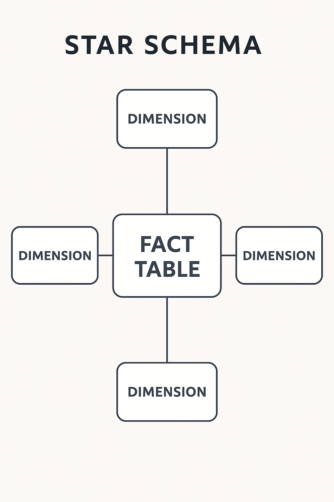

<h1 align="center">🛠️ Olist Data Engineering Project — AWS Medallion Architecture</h1>

<p align="center">
  <strong>End-to-end Data Lakehouse built with PySpark, AWS S3, and the Medallion Architecture.</strong>
</p>

---

# 📌 Overview

This project implements a full **Data Engineering pipeline** using the Olist e-commerce dataset and the **Medallion Architecture (Raw → Bronze → Silver → Gold)** on AWS S3.

It simulates a real production scenario, including:

- Data ingestion from CSV (Raw)
- Transformation and standardization (Bronze)
- Cleaning and enrichment (Silver)
- Analytical modeling with Star Schema (Gold)
- JSON schema versioning for all layers
- Protected Git workflow with Pull Requests

---

# 🏗️ Architecture

## 🔷 Medallion Architecture


### 🟫 RAW
Stores original CSV files exactly as received, without transformation.

### 🟧 BRONZE
Structured and standardized data, stored in Parquet format.

### ⚪ SILVER
Clean, enriched, analytics-ready data.

### 🟨 GOLD
Business-level tables in a **Star Schema** for BI tools and analytics.

---

# ⭐ Star Schema (Gold Layer)



The Gold layer includes:

- Fact Sales
- Dim Customer
- Dim Product
- Dim Seller
- Dim Date
- Dim Geolocation

---

# 📁 Repository Structure

```md
OLIST_PROJECT_ETL_AWS/
│
├── architecture/
│   ├── medallion_overview.md
│   ├── medallion.png
│   └── star_schema.png
│
├── RAW/
│   ├── Notebooks/
│   │   ├── check_schemas.ipynb
│   │   └── sample_schemas/
│   │       ├── category_schema.json
│   │       ├── customer_schema.json
│   │       ├── geolocation_schema.json
│   │       ├── items_schema.json
│   │       ├── orders_schema.json
│   │       ├── payments_schema.json
│   │       ├── products_schema.json
│   │       └── sellers_schema.json
│
├── venv/
│
└── README.md


---

# 🧰 Technologies Used

| Technology | Purpose |
|-----------|---------|
| AWS S3 | Data Lake storage |
| PySpark | ETL processing and schema enforcement |
| Parquet | Optimized columnar storage |
| AWS CLI | Authentication and access |
| Python | ETL logic and orchestration |
| VSCode | Local development |
| GitHub | Versioning and PR workflow |

---

# ⚙️ Running the Project Locally

##  Initialize Spark with S3 Access

# This project uses protected main branch + Pull Request workflow.

Branch strategy:

main                  → stable production branch
feature/raw-layer     → Raw ingestion development
feature/bronze-layer  → Bronze transformations
feature/silver-layer  → Silver cleaning & enrichment
feature/gold-layer    → Star schema modeling
docs                  → Documentation updates

Requirements:

- Pull Request is required to merge into main

- Force push is blocked

- Code review required

- Conversation threads must be resolved

# 📈 Roadmap

- [x] Setup AWS & Spark environment  
- [x] Load RAW CSV data from S3  
- [x] Generate JSON schemas  
- [ ] Implement Bronze transformations  
- [ ] Build Silver layer cleaning  
- [ ] Create Gold fact & dimension tables  
- [ ] Add Athena/Glue catalog integration  
- [ ] Build dashboards for analytics  

🧑‍💻 Author

Pedro Filho — Data Engineering Project (AWS + PySpark + Medallion Architecture)